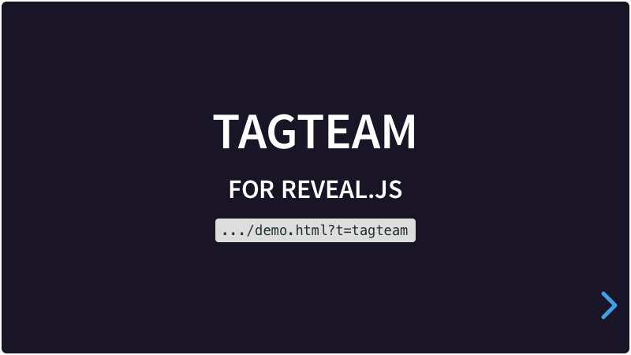

# Tagteam

A plugin for [Reveal.js](https://revealjs.com) which is used to dynamically show only certain sections in presentations when you don't want to show everything. It uses URL parameters to set the needed sections.

[](https://martinomagnifico.github.io/reveal.js-tagteam/demo.html)

An option to use groups is also provided. Also, the need to enter a group can be set, to avoid the possibility to view all slides (no parameters at all). This is just a simple safeguard. Anyone with a bit of HTML knowledge can find the valid group names. 

[Demo](https://martinomagnifico.github.io/reveal.js-tagteam/demo.html)

Tagteam reads 3 different URL parameters:

1. `?t=abcd` for data-tag sections
2. `?n=abcd` for data-name sections
3. `?g=abcd` for predefined groups

Any named or tagged section that is NOT in a parameter will NOT be shown. Sections without tags or name WILL be shown.

You can also use a `data-keep` attribute, like the title section of the demo presentation, to make sure that the slide will always be shown, except when a group is mandatory.


## Installation

### Regular installation

Copy the tagteam folder to the plugins folder of the reveal.js folder, like this: `plugin/tagteam`.


### npm installation

This plugin is published to, and can be installed from, npm.

```console
npm install reveal.js-tagteam
```
The Tagteam plugin folder can then be referenced from `node_modules/reveal.js-tagteam/plugin/tagteam`

## Setup

### JavaScript

Tagteam works in setups with multiple Reveal instances. However,  the usecase will be quite slim, because multiple instances run in a single browser window, where only one range of parameters can be set.

There are two JavaScript files for Tagteam, a regular one, `tagteam.js`, and a module one, `tagteam.esm.js`. You only need one of them:

#### Regular 
If you're not using ES modules, for example, to be able to run your presentation from the filesystem, you can add it like this:

```html
<script type="text/javascript" src="dist/reveal.js"></script>
<script src="plugin/tagteam/tagteam.js"></script>
<script>
	Reveal.initialize({
		// ...
		plugins: [ Tagteam ]
	});
</script>
```
#### As a module 
If you're using ES modules, you can add it like this:

```html
<script type="module">
	// This will need a server
	import Reveal from './dist/reveal.esm.js';
	import Tagteam from './plugin/tagteam/tagteam.esm.js';
	Reveal.initialize({
		// ...
		plugins: [ Tagteam ]
	});
</script>
```


### HTML

#### Tags

It is easy to set up your HTML structure for Tagteam. Just add tags to your slides. Tags can consist of only 1 word per tag. And remember, untagged slides WILL be shown if they do not match the URL parameter. You can also tag the parent stack sections. 

```html
<section data-tag="nice">
	<section data-tag="cats, small">Cat (brown, small, nice)</section>
	<section data-tag="dogs">Dog (brown, nice)</section>
	<section data-tag="dogs, big">Dog (brown, big, nice)</section>
	<section data-tag="horses">Horse (brown, nice)</section>
</section>
<section>
	<section data-tag="cats">Cat (black &amp; white)</section>
	<section data-tag="dogs, small">Dog (black &amp; white + small)</section>
	<section data-tag="horses">Horse (black &amp; white)</section>
</section>
```


Using tags:
 
- [demo.html?t=dogs](https://martinomagnifico.github.io/reveal.js-tagteam/demo.html?t=dogs)
- [demo.html?t=dogs,cats](https://martinomagnifico.github.io/reveal.js-tagteam/demo.html?t=dogs,cats)
- [demo.html?t=dogs,cats+small](https://martinomagnifico.github.io/reveal.js-tagteam/demo.html?t=dogs,cats+small)
- [demo.html?t=small+cats,nice+horses](https://martinomagnifico.github.io/reveal.js-tagteam/demo.html?t=small+cats,nice+horses)


#### Names

When ordering your presentation with nested sections, you can specify these to be shown in one fell swoop. Names can consist of several words, like "About us". When Tagteam works together with [Simplemenu](https://github.com/Martinomagnifico/reveal.js-simplemenu) in auto-mode, it uses the (data-)names to only show the relevant chapters in the menu.

```html
<section data-name="Brown" data-tag="nice">
	<section data-tag="cats, small">Cat (brown, small, nice)</section>
	<section data-tag="dogs">Dog (brown, nice)</section>
	<section data-tag="dogs, big">Dog (brown, big, nice)</section>
	<section data-tag="horses">Horse (brown, nice)</section>
</section>
<section data-name="Black &amp; white">
	<section data-tag="cats">Cat (black &amp; white)</section>
	<section data-tag="dogs, small">Dog (black &amp; white + small)</section>
	<section data-tag="horses">Horse (black &amp; white)</section>
</section>
```


Using names:
 
- [demo.html?n=brown](https://martinomagnifico.github.io/reveal.js-tagteam/demo.html?n=brown)
- [demo.html?n=brown,black+%26+white](https://martinomagnifico.github.io/reveal.js-tagteam/demo.html?n=brown,black+%26+white)


Names and tags can be combined. When the user wants to only show slides with "black and white horses and small black and white dogs", the URL parameter can be like this:

- [demo.html?n=black+%26+white&t=horses,small+dogs](https://martinomagnifico.github.io/reveal.js-tagteam/demo.html?n=black+%26+white&t=horses,small+dogs)

#### Groups

Groups are predefined sets of tags and/or names. Each definition is a 'groups' object in the options for Tagteam, and each object needs a name and an array of tags and/or an array of names.

```javascript
Reveal.initialize({
	//...
	tagteam: {
		groups: {
			"brownpets": {
				names: ["brown"], tags: ["cats", "dogs"]
			},
			"bwhsd": {
				 names: ["black & white"], tags: [ "horses", ["dogs", "small"] ]
			}
		}
	},
	plugins: [ Tagteam ]
});
```

When the user wants to only show slides with "black and white horses and small black and white dogs", the URL parameter can be like this: `g=bwhsd`, which is a lot shorter than in the names/tags combination URL parameter:

- [demo.html?g=bwhsd](https://martinomagnifico.github.io/reveal.js-tagteam/demo.html?g=bwhsd)

**Setting the mandatorygroup option**

It is possible to set the use of a group to mandatory. This way you can avoid the possibility for users to see all slides by just not entering any URL parameter.

```javascript
Reveal.initialize({
	//...
	tagteam: {
		mandatorygroup: true,
		groups: {
			"brownpets": {
				names: ["brown"], tags: ["cats", "dogs"]
			}
		}
	},
	plugins: [ Tagteam ]
});
```

**Note**: This is just a simple safeguard. Anyone with a bit of HTML knowledge can find the valid group names.

With `mandatorygroup : true` and a correct `g` parameter, the slides will show.

- [demo-m.html?g=brownpets](https://martinomagnifico.github.io/reveal.js-tagteam/demo-m.html?g=brownpets)

With `mandatorygroup : true` and an incorrect `g` parameter, the slides will show. Only slides with `data-mandatory` will be shown.

- [demo-m.html?g=pinkpets](https://martinomagnifico.github.io/reveal.js-tagteam/demo-m.html?g=pinkpets)


## Configuration

There are a few options that you can change from the Reveal.js options. The values below are default and do not need to be set if they are not changed.

```javascript
Reveal.initialize({
	//...
	tagteam: {
		debug: false,
		mandatorygroup: false,
		groups: {
			"pets": {
				t: ["cats", "dogs"],
				n: ["red"]
			}
		}
	},
	plugins: [ Tagteam ]
});
```

* **`debug`**: This option can show debug messages in the console.
* **`mandatorygroup`**: This option can set the mandatory use of groups.
* **`groups`**: This contains a standard placeholder for predefined groups.


